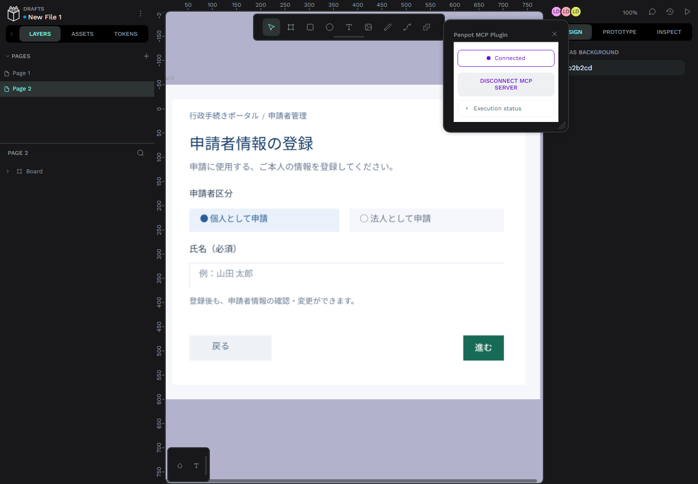
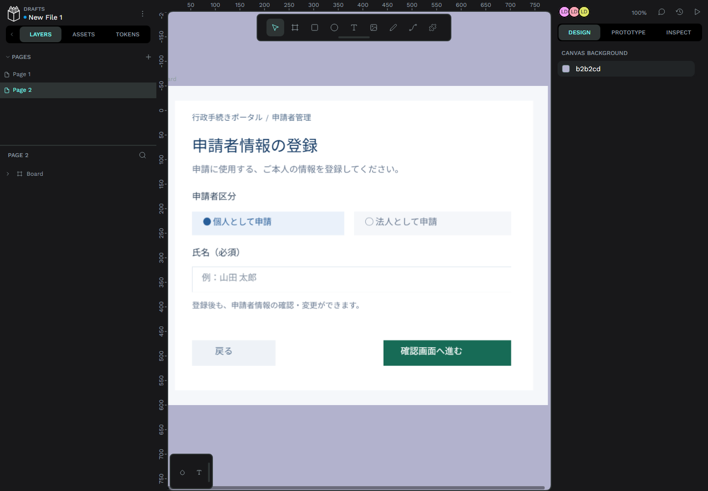
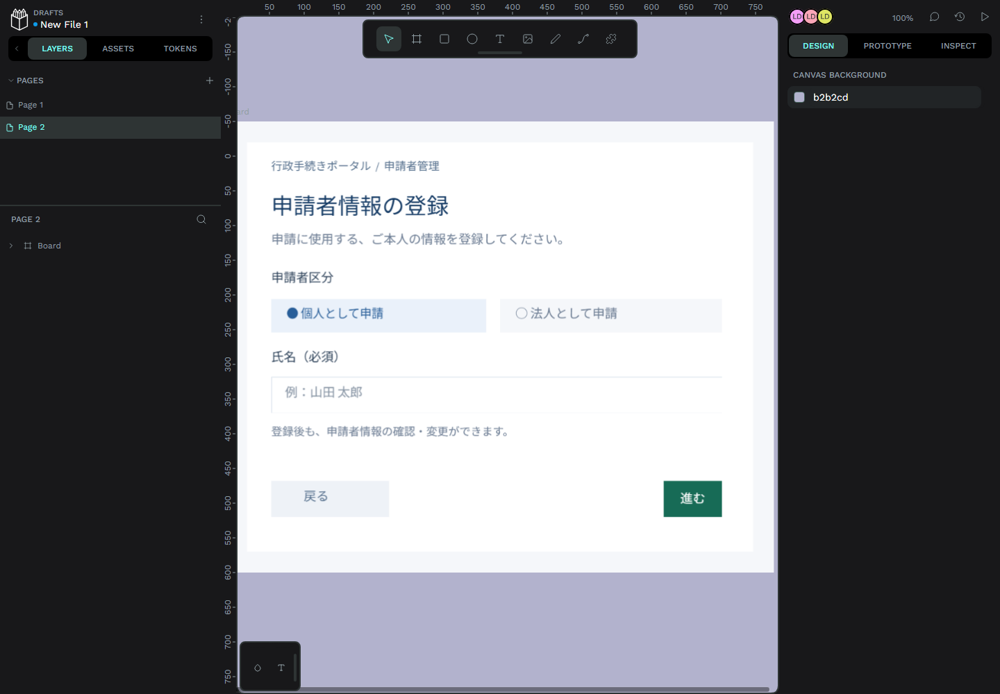

# Orca + Codex + Penpot 申請者管理ワークベンチ

公的機関の事務処理システムを想定した、個人・法人の申請者CRUDサンプルと画面修正用のローカル開発環境です。実在する行政サービスではありません。

環境の説明やプレゼン資料の作成には、[要件に合わせて選べるAI画面修正と開発環境](docs/development-environment-overview.md)を参照してください。AIへの一括指示、Penpotでのpx単位の調整、Orcaの注釈・スクリーンショットによる指示の使い分けと、構成・起動・検証方法をまとめています。

[目標と受け入れ条件](docs/goal.md)を、初期依頼から逆算して定義しています。サンプル構築、動画作成、MCP直接編集、README整備までの記録は、[プロジェクト構築経緯](docs/project-history.md)にまとめています。

## 初心者向けの操作動画

[字幕付きMP4](video/penpot-beginner-ja.mp4)（2分11秒・音声なし）を作成しました。[章選択・説明文付きプレーヤー](video/index.html)からも視聴できます。Penpotの練習用ページで、見出し変更、ボタン色変更、取り消し／やり直し、再読込による保存確認を実演しています。[詳しい説明](video/README.md)。

## 開く

| 用途 | URL |
|---|---|
| 申請者管理サンプル（開発用コンテナ） | http://localhost:3201 |
| Penpot 2.15.4 | http://localhost:9001 |
| Penpot公式MCP | http://localhost:4401/mcp |
| MCPプラグインの登録URL | http://localhost:4400/manifest.json |

全ポートは127.0.0.1限定。PostgreSQL、Valkey、MinIOはホストへ公開しません。

## コンテナで画面を修正し、保存直後に反映する

画面（Vite）とAPI（Express）は一つの開発用コンテナで動きます。**AIが編集する作業フォルダーの `applicant-workbench`** から実行します。申請者管理だけならPenpotの起動や `.env` は不要です。

```powershell
docker volume create applicant-workbench_app-data
docker compose -f compose.dev.yaml up -d --build
```

ボリューム作成は初回用です。同名の既存ボリュームがある場合は、そのデータを保持して再利用します。Composeでは外部ボリュームとして参照します。

**http://localhost:3201 を開いてください。** `src/`、`design/`、`index.html`、`vite.config.js` はホストのファイルをコンテナが参照し、React/CSSの保存をViteが検知してブラウザへ反映します。Windows向けにポーリング監視を有効にしています。ホスト側の `npm run dev` とは同じポートを使うため、どちらか一方だけを起動します。

Composeプロジェクトは `applicant-workbench-ui` です。Viteが同じコンテナ内のAPIへ接続します。API用の3200番はコンテナ内部のみで、ホストへ公開しません。申請者データとセッション署名鍵は既存の `applicant-workbench_app-data` ボリュームを引き継ぎます。旧表示用の `app` コンテナは廃止しました。

AIには、例えば「申請者登録画面の見出しを変更し、3201番の画面で確認してください」と依頼できます。**マウント元は起動コマンドを実行したチェックアウト**です。別のOrcaワークスペースへ切り替える場合は、新しい作業フォルダーから同じコマンドを実行してコンテナを再作成してください。

画面ソースの編集には再ビルド不要です。`server/` も直接マウントしており、API変更後は `docker compose -f compose.dev.yaml restart ui` で反映します。依存関係（`package.json` / `package-lock.json`）、`Dockerfile.dev`、`scripts/dev-container.mjs` を変えた場合は、上記コマンドで再ビルドします。

開発画面を既存のテスト・キャプチャで検証する場合（ホスト側のnpm依存関係とPlaywright Chromiumが必要）:

```powershell
npm.cmd run test:e2e
npm.cmd run capture
```

テスト・キャプチャ・SVG書き出しの既定の接続先は3201番です。停止は `docker compose -f compose.dev.yaml stop`、再開は `docker compose -f compose.dev.yaml up -d`。Penpotの `docker compose stop` と開発コンテナの停止は別です。

参考: [Dockerのバインドマウント](https://docs.docker.com/engine/storage/bind-mounts/)、[Viteのファイル監視](https://vite.dev/config/server-options#server-watch)。

## 起動・停止

前提: Docker Desktop (Linux containers)、Node.js 22.17以上、PowerShell 7。初回はイメージ／パッケージ取得のためネット接続が必要です。

```powershell
cd C:\ClaudeCode\shift-team-a\applicant-workbench
pwsh -File scripts/setup.ps1
npx.cmd playwright install chromium
```

すでに構築済みの場合（`compose.yaml` はPenpot一式、`compose.dev.yaml` は申請者管理）:

```powershell
docker compose up -d
docker compose -f compose.dev.yaml up -d
docker compose -f compose.dev.yaml ps
docker compose -f compose.dev.yaml stop
docker compose stop
```

`stop` はデータを保持します。`docker compose down -v` はデータを削除するため通常は使わないでください。秘密値は初回だけランダム生成される `.env` に保存します。

別の作業フォルダーから既存のPenpotを操作する場合は、例えば `docker compose --env-file "C:/path/to/existing/applicant-workbench/.env" up -d` のように既存設定の実際のパスを指定します。開発用の `compose.dev.yaml` には不要です。

## サンプルでできること

- 自分が管理する申請者一覧、名前／フリガナ／法人番号／メール検索、個人・法人絞り込み、並び替え、ページング。
- 個人登録、法人登録（法人番号・代表者追加）、入力確認、登録完了。
- 詳細表示、変更履歴、編集、削除確認と削除キャンセル。
- 入力エラー、空状態、読込・保存失敗表示、更新競合の検出。
- 利用者ごとのデータ分離、永続化、キーボード操作、スマートフォン表示。

「山田 太郎」は個人・代表法人の架空プロフィール3件、「佐藤 花子」は空の状態から試せます。右上のデモ利用者切り替えで確認してください。**この切り替えは開発用であり、本人認証ではありません。** 法人番号は13桁の形式・重複のみ検証し、実在確認や代表権確認は行いません。

## Codexで画面を修正する

Orcaを使う場合は、[Orcaでの画面修正フロー](docs/orca-ui-workflow.md)を参照してください。作業フォルダーの確認、開発画面の起動、Codexへの修正依頼、Orca内蔵ブラウザでの確認、Penpotへの反映、取り消しまでを説明しています。

1. この `applicant-workbench` フォルダーをCodexのプロジェクトとして開きます。
2. `.codex/config.toml` のMCP設定を読み込むため、必要に応じてプロジェクトを再度開きます。設定見本は `docs/codex-config.toml`。
3. `docker compose -f compose.dev.yaml up -d --build` を実行。3201番で画面・APIの両方を利用できます。
4. 例:「法人登録画面に部署名を任意項目として追加。Penpotと実装を更新し、入力→確認→詳細の表示と個人登録への影響を検証してください」。
5. `npm test` → `npm run test:e2e` → `npm run capture`。APIを変更した場合は、先に `docker compose -f compose.dev.yaml restart ui` を実行します。

OpenAI APIをアプリから直接呼びません。Codexの通常のログインを使います。プロジェクトにAPIキーを置く必要はありません。

## Penpotとの接続

ローカルアカウントは `data/penpot-local.json` が存在する場合に保存されています。秘密値をGitに追加しないでください。未作成の場合はPenpot画面の「Create an account」からローカル用アカウントを作成してください。メール確認はこのローカル環境のみ無効です。

1. Penpotでデザインファイルを開く。
2. Pluginsから `http://localhost:4400/manifest.json` を登録して「Penpot MCP Plugin」を開く。
3. 「Connect to MCP server」を押す。**プラグインを開いたまま**にする。
4. Codexの `penpot` MCPから説明ツール・API仕様を取得して操作する。

MCPはPenpotと同じ2.15.4に固定。HTTPは4401、プラグイン配信4400、WebSocket4402。MCPのローカルファイルアクセスは `PENPOT_MCP_REMOTE_MODE=true` で無効です。デザインファイルへの操作は可能です。

### Codexへ指示してPenpotを修正する（実例）

今回の構成では、Penpot内にAIプロバイダーやAPIキーを設定しません。Penpotで対象ファイルとMCPプラグインを開き、**Codexのチャットへ日本語で指示**します。CodexがMCPを通じて、現在開いているPenpotファイルのレイヤーを読み取り・変更します。

1. Penpotで修正対象のページを開きます。
2. ツールバーの **Plugins** から **Penpot MCP Plugin** を開き、表示が `Connected` になっていることを確認します。直接編集を行う間は、対象ファイルとプラグインを開いたままにします。

   

3. Codexのチャットに、対象と変更内容を具体的に入力します。今回、最初に送った指示は次のとおりです。

   > 「確認画面へ進む」の文言を「進む」にしてください。

   修正前は、ボタンが幅260pxで「確認画面へ進む」と表示されていました。

   

   Codexは該当するテキストレイヤーをMCPで特定し、文言を変更しました。続いて、次の指示を送りました。

   > 「進む」ボタンの大きさが文字の長さに比べて大きいので、文字の大きさにそろえてください。

   この指示では、文字幅を基準に左右の余白を加え、ボタンを幅84pxに縮小して文字を中央配置しました。

4. Penpotのキャンバスで結果を確認します。修正後は「進む」となり、ボタン幅は84pxです。

   

指示には「Page 2の進むボタン」「背景色を `#176B56`」のように、ページ名、対象、変更後の値を含めると特定しやすくなります。意図と違った場合は「元に戻してください」、または希望する寸法・色・配置を追加で伝えてください。Penpotは自動保存されるため、変更後は再読み込みして状態が残ることも確認します。

この操作で変わるのはPenpotのデザインです。動く申請者管理サンプルにも反映する場合は、Codexへ「Penpotとサンプルアプリの両方を修正し、テストしてください」と指示します。

`design/screens/` のSVGは文字・図形からなる編集可能な参照画面です。Penpotのキャンバスへドラッグして使用できます。実装のCSSを変えた後は `node scripts/export-designs.mjs` で再生成します。SVGはUI構造を編集しやすく残すための参照で、Reactと自動双方向同期するわけではありません。

## ブラウザ検証・復旧

```powershell
npm run test:e2e
npm run capture
node scripts/start-browser.mjs
# 専用ブラウザを開いたまま、別のターミナルで:
node scripts/penpot-pilot.mjs
node scripts/reconnect-plugin.mjs
```

専用プロファイル `.browser-profile/` とCDP 9222を使い、通常の個人ブラウザには接続しません。`reconnect-plugin` は既知のRetryと開いているMCPパネルに対応。パネルが閉じている場合は、曖昧なメニュー操作をせず、開き直しを案内して終了します。

画像比較（Python + Pillowが必要）:

```powershell
python scripts/design-loop.py design/reference.png artifacts/actual.png --tolerance 30 --max-difference 0.05
```

同じサイズの画面書き出しを9領域で比較し、差分PNGとJSONを生成。これは差分検出であり、達成していない一致率を保証するものではありません。

## 構成・データ

| 要素 | 保存先 |
|---|---|
| React UI / Express API | `src/` / `server/` |
| 申請者SQLite / セッション署名鍵 | Docker `applicant-workbench_app-data` ボリューム |
| Penpot構造・ユーザー | PostgreSQL `penpot-db` ボリューム |
| Penpot画像・アセット | MinIO `penpot-assets` ボリューム |
| 色トークン / 編集可能SVG | `design/tokens.css` / `design/screens/` |
| スクリーンショット・差分 | `artifacts/`（Git除外） |

バックアップは停止状態でボリュームを保存するか、PostgreSQLの論理バックアップとMinIOのコピーを組み合わせてください。Penpotの`.penpot`エクスポートをデザイン変更と一緒に管理できます。Git LFSはこの環境では自動設定していません。

## 資料からの採用と補正

添付2資料のPenpot・PostgreSQL・MinIO・Valkey、MCP、Playwright/CDP、画面比較の構成を採用しました。Claude用`.mcp.json`を流用せず、Codex用TOMLとStreamable HTTPを使っています。

- 確実に利用できるPenpot本体と公式MCPの同一バージョンに固定。
- MinIOはDocker Hubで取得できなかったため公式Quayイメージを使用。
- UIは小規模サンプルに適したReact/Vite。Next.jsのSSRは本サンプルでは不要と判断。
- Penpotのテレメトリは無効。**セルフホストは、Codexへ渡したコード・画像・MCP応答が外部AI処理に渡らないことを保証しません。** 本環境はネットワーク遮断構成ではありません。
- 資料のライセンス断定、モデル間の優劣や99.9%一致などの実験値は、今回の検証結果として扱いません。
- 本番化には認証・本人確認・代表権確認・権限モデル、公開時のTLS、実データの保管・監査設計が別途必要です。

公式資料: [Penpot Docker](https://help.penpot.app/technical-guide/getting-started/docker/)、[Penpot公式MCP](https://github.com/penpot/penpot/tree/develop/mcp)、[Codex MCP](https://developers.openai.com/codex/mcp)。
