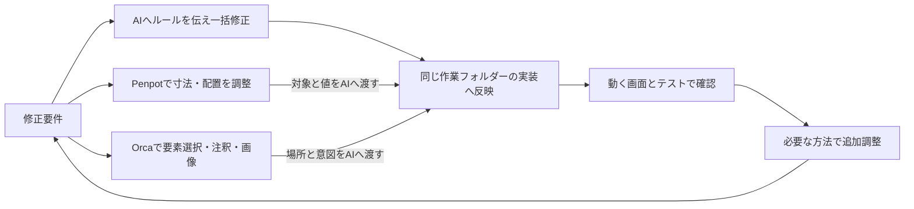
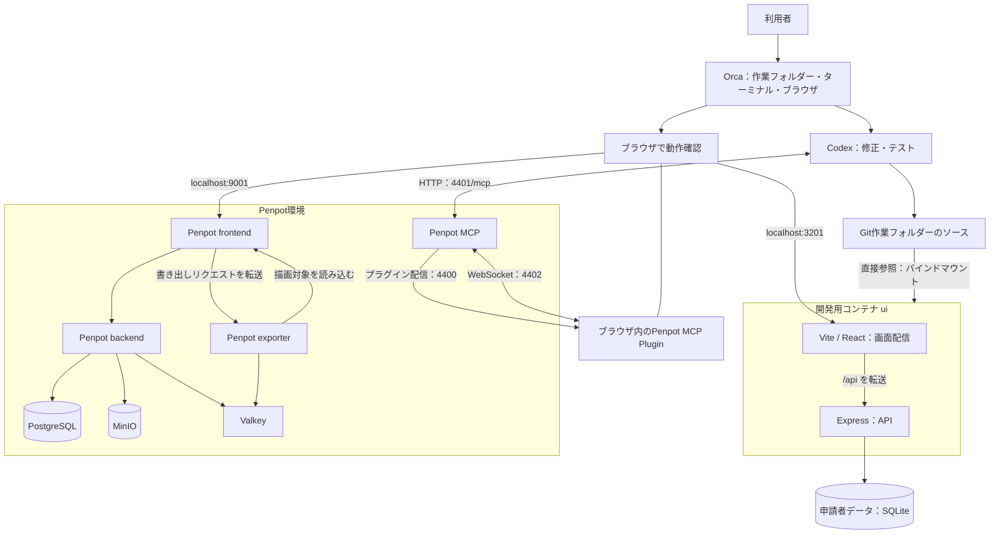

# Orca + Codex + Penpot：要件に合わせて選べるAI画面修正

プレゼン資料の元原稿として、AIへの一括指示、Penpotでの細かなデザイン調整、Orcaの注釈・スクリーンショットによる修正依頼を、要件に応じて使い分ける方法をまとめた資料です。後半には、それらを支える開発環境の構成・保存先・起動手順を掲載しています。環境構成は2026年9月22日時点です。

[READMEへ戻る](../README.md) · [具体的な画面修正手順](orca-ui-workflow.md)

**プレゼンの中心は第1章の使い分けと第10章のスライド案です。** 第2〜4章は仕組みを説明する補足、第5〜8章は実演・導入時の操作資料、第9章は確認済みの範囲を示す根拠として使えます。

## 1. この環境で実現すること

**多くの箇所をまとめて直す。細部をpx単位で決める。動く画面を指して伝える。修正要件に合った方法を選び、AIによる実装と検証へつなげる開発環境です。**

サンプルとして、公的機関の事務処理を想定した「申請者管理」を用意しています。個人・法人の登録、検索、詳細表示、編集、削除を実際に操作しながら、画面や処理を修正できます。

主な利用場面は、画面案の検討、業務担当者とのレビュー、AIを使った修正の実演、変更後の動作確認です。実在する行政サービスや本番運用システムではなく、架空データを使う開発用サンプルです。

### 1.1 要件に合わせた三つの修正方法

| 修正したいこと | 向いている方法 | 人が決めること | AIに任せること | 効率化できる作業 |
|---|---|---|---|---|
| 多数の画面の文言・色・共通ルールをまとめて変更 | **AIへ自然言語で一括指示** | 対象範囲、変更ルール、例外 | 関連箇所の調査、コード修正、整合性確認 | 同じ内容を箇所ごとに依頼・編集する作業 |
| 余白・高さ・位置などをpx単位で詰める | **ユーザーがPenpotで調整し、AIへ反映依頼** | 見た目を確認しながら具体的な寸法・配置を決定 | 決めたデザインを読み取り、実装へ反映 | 数値や完成イメージを文章だけで説明する作業 |
| 動く画面を見て、気になる箇所を直す | **Orcaで要素を選び、注釈・スクリーンショットで指示** | 対象箇所と、どう変えたいか | 画面の情報を手がかりにコードを修正 | 対象の場所や見え方を言葉だけで特定する作業 |
| 共通変更のあと、一部だけ見た目を仕上げる | **三つを組み合わせる** | 共通ルールと個別の仕上がり | 一括修正、個別反映、回帰確認 | 大きな変更と細かな調整の往復 |

方法ごとに新しい実行環境を作る必要はありません。同じアプリに対し、変更内容を伝える入口を選びます。三つの方法は得意な場面が異なるだけで、数値を直接AIへ指示したり、Orcaの複数注釈をまとめて修正したりする組み合わせもできます。

表の効率化は、減らせる手作業や説明の往復を示しています。作業時間の短縮率を測定した結果ではありません。修正規模に応じてAIが複数回に分けて作業する場合もあり、完了は差分・実画面・テストで確認します。

### 1.2 方法A：AIへの一括指示で多数の箇所を修正する

共通のルールを説明できる変更に向いています。例えば、個人・法人の両フォームでラベルを統一する、複数画面のボタン色をそろえる、項目追加を入力・確認・詳細・保存処理まで反映する、といった依頼です。

**人は変更ルールを一度まとめ、AIは関連する実装を調べて複数箇所へ適用します。** 依頼には、含める画面、除外する要素、変更後に確認する操作を添えます。

> 個人・法人の登録画面と編集画面にある主操作ボタンの高さを44px、背景色を #176B56 に統一してください。削除・キャンセルのボタンは対象外です。共通スタイルを確認して関連箇所をまとめて修正し、確認・詳細画面への影響と390px幅での表示を検証してください。

「同じ見た目だからすべて置換する」ではなく、役割が同じ要素を対象にします。AIから変更箇所の一覧とテスト結果を受け取り、人が対象範囲と仕上がりを確認します。

### 1.3 方法B：Penpotでpx値を調整し、AIへ実装を引き継ぐ

位置・サイズ・間隔を見ながら決めたい変更に向いています。ユーザーがPenpotで対象を選び、プロパティで寸法や配置を調整します。Flex Layoutでは要素間隔や内側余白も指定できます。[Penpot公式：プロパティの説明](https://help.penpot.app/user-guide/first-steps/the-interface/)、[Flex Layout](https://help.penpot.app/user-guide/designing/flexible-layouts/)

例えば、一括変更で44pxにそろえたボタンを見直し、「高さ48px、左右の内側余白24px、ボタン間隔16px」のように仕様を詰めます。対象ファイル・ページ・レイヤーとともにAIへ伝えます。

> Penpotの「（対象ファイル）」の「（個人登録のページ）」で、主操作ボタンの高さを48px、左右の内側余白を24px、ボタン間隔を16pxに調整しました。対象レイヤーの値を確認してアプリへ反映してください。法人登録にも同じルールを適用し、390px幅では画面からはみ出さないようにしてください。

括弧内は実際のファイル名・ページ名に置き換えます。アプリから書き出したSVGを取り込んだ場合は、図形・文字の位置やサイズを調整できます。ただし、元のReactコンポーネントやFlex Layoutまで再現されるわけではありません。内側余白や要素間隔をレイアウトの設定値として扱う場合は、Penpot側で対象をボードやFlex Layoutとして整えます。

MCP接続時はAIが対象デザインを読み取れます。**ユーザーがデザインの細部を決め、AIがコードへの反映を担当する分担**です。デザインのpx値は実装時の基準として使い、画面幅に応じた折り返しや伸縮は実際のブラウザで確認します。Penpotでの保存だけではアプリは変わらず、AIへの反映依頼が必要です。

### 1.4 方法C：Orcaで実画面を指し、注釈・スクリーンショットで伝える

実際の画面で見つけた「この部分を直したい」を伝える方法です。OrcaのDesign Modeでは、選択した要素のHTML、計算済みCSS、切り抜き画像をAIへ渡せます。複数の注釈をためてから送ることもできます。ソース位置の情報は、対応するソースマップがある場合に付与されます。[Orca公式：Design Mode](https://www.onorca.dev/docs/browser/design-mode)

1. Orcaのブラウザで `http://localhost:3201` を開き、対象画面を表示します。
2. Design Modeで対象要素を選び、変更したい内容を注釈にします。
3. 必要なら複数箇所の注釈をまとめ、画面情報とともにAIへ伝えます。
4. AIの修正後に同じ画面・操作で確認し、残った箇所を追加で指示します。

> 注釈を付けた3箇所をまとめて修正してください。①見出しと説明文の間隔を8pxにする、②登録ボタンを見出しの右端にそろえる、③一覧の氏名列の余白を詰める。PCで確認し、390px幅では登録ボタンを全幅にしてください。

画面全体のスクリーンショットを材料に、全体のバランスや複数箇所をまとめて指示する方法もあります。画像だけを渡す場合は、対象のURL・画面名・画面幅も添えます。Design Modeの要素選択で渡すHTML・CSSの情報と、画像だけの指示は区別します。

**画像は見え方を共有し、注釈は場所と意図を示し、数値は仕上がりの基準を決める**ために使います。数値が重要な場合は画像からの推測に任せず、「16px」などの値も添えます。

### 1.5 方法を組み合わせるときの進め方



使い分けの例は、**共通ルールをAIでまとめて変更 → Penpotで代表画面の寸法を詰める → AIが各画面へ反映 → Orcaで残った箇所に注釈を付けて仕上げる**、という流れです。すべての変更で三つを使う必要はなく、文言変更だけならAIへの一括指示で進められます。

### 1.6 プレゼンで見せるデモの流れ

| 場面 | 見せる操作 | 伝えるポイント |
|---|---|---|
| 多数の箇所をそろえる | 個人・法人フォームの共通変更を一度に依頼し、差分を見る | 一つの指示で関連する複数箇所を扱える |
| 細部を決める | 一括変更した44pxのボタンをPenpotで48pxへ調整し、間隔も指定してAIへ反映を依頼 | ユーザーがpx単位で仕上がりを決められる |
| 動く画面から直す | Orcaで対象を選び、注釈と画面情報をAIへ送る | コード上の場所を探さず、見ている箇所から依頼できる |
| 結果を確かめる | 更新した画面と操作テストを確認する | 三つの入口が同じ実装・検証につながる |

ここに示す依頼と数値はデモ用の例です。現在の画面にすべて適用済みという意味ではありません。実演前に対象画面と各ツールの接続を確認します。

## 2. ツールの役割

| ツール・技術 | この環境での役割 | 利用者が行うこと |
|---|---|---|
| Orca | 作業フォルダー、ターミナル、内蔵ブラウザとDesign Mode | 実画面の要素選択・注釈・画像を使って修正を依頼する |
| Codex | 指示に基づくソースの修正、テスト、結果の説明 | 対象画面・変更内容・確認してほしい操作を伝える |
| Penpot | 画面デザインの作成・編集・確認 | 文字、色、配置やpx単位の寸法・間隔を調整する |
| Git | ソースとドキュメントの変更履歴管理 | 差分を確認し、コミット・共有する |
| Docker Compose | 開発アプリとPenpotの実行環境を起動・停止 | コマンドで必要な環境を立ち上げる |
| React / Vite | 実際に操作する画面と、保存時の画面反映 | ソースを保存して表示を確認する |
| Express / SQLite | 登録・検索・更新・削除のAPIとデータ保存 | 画面操作を通じて利用する |
| Playwright | ブラウザによる操作テストと画像取得 | 修正後の操作・表示を検証する |

Orca・Codexはホスト側で利用します。アプリ自身がOpenAI APIを直接呼ぶ機能はありません。

## 3. 全体構成

**申請者管理の画面とAPIは、一つの開発用コンテナで動きます。Penpotは独立したコンテナ群で動きます。**



図は主要な接続関係を示します。Penpot frontendのプロキシは通常のAPIをbackendへ、`/api/export` をexporterへ転送します。MCPがやり取りする相手は、frontendコンテナ自体ではなく、ブラウザで開いたPenpotのプラグインです。

ブラウザからの入口は、申請者管理が **3201番**、Penpotが **9001番** です。Expressは開発用コンテナ内部の3200番で動き、ViteがAPIへの通信を転送します。ホストの3200番を開く必要はありません。

### コンテナの内訳

| Composeファイル | サービス | 役割 | ホスト側の公開ポート |
|---|---|---|---|
| `compose.dev.yaml` | `ui` | 申請者管理の画面とAPI | 3201 |
| `compose.yaml` | `penpot-frontend` | Penpotの画面 | 9001 |
| 同上 | `penpot-backend` | PenpotのAPI・プロジェクト処理 | なし |
| 同上 | `penpot-exporter` | デザインの書き出し処理 | なし |
| 同上 | `penpot-local-mcp` | AIとPenpotをつなぐMCPサービス | 4400・4401・4402 |
| 同上 | `penpot-postgres` | デザイン構造・ユーザー情報の保存 | なし |
| 同上 | `penpot-valkey` | Penpot内部で使うRedis互換サービス | なし |
| 同上 | `minio` | 画像・アセットの保存 | なし |

全体を起動した場合は常駐8コンテナです。別途、起動時にバケットの存在を確認・作成して終了する `minio-init` があります。公開ポートはすべて `127.0.0.1` に限定しています。申請者管理だけを使う場合は `ui` の1コンテナで動作し、Penpotは必須ではありません。

## 4. ソース・デザイン・データはどこに保存されるか

| 対象 | 保存先 | 反映・保存のタイミング |
|---|---|---|
| 画面のソース | 作業フォルダーの `src/`、`design/tokens.css` など | 保存するとViteが画面へ反映 |
| APIのソース | 作業フォルダーの `server/` | 保存後、開発用コンテナを再起動して反映 |
| ソース・手順書の履歴 | Git | コミットで履歴に記録。共有先への反映にはプッシュが必要 |
| 申請者データ | Dockerボリューム `applicant-workbench_app-data` 内のSQLite | APIによる登録・更新・削除時に保存 |
| セッション署名鍵 | 同ボリューム内の `.session-key` | API起動時にファイルがなければ生成し、以後は再利用 |
| Penpotのデザイン構造・ユーザー | Dockerボリューム `applicant-workbench_penpot-db` | Penpot側で保存 |
| Penpotの画像・アセット | Dockerボリューム `applicant-workbench_penpot-assets` | Penpot側で保存 |
| アプリから書き出した参照用SVG | `design/screens/` | SVG書き出しコマンドで更新 |
| 画面キャプチャ | `artifacts/` | キャプチャコマンドで生成。Git管理対象外 |

**Gitの作業ファイルと開発用コンテナは同じソースを参照します。一方、Penpotのプロジェクトは別の保存先です。**

開発用コンテナには `src/`、`design/`、`index.html`、`vite.config.js`、`server/` を読み取り専用でマウントします。Codexはホスト側のファイルを編集し、コンテナはその内容を参照します。コンテナの停止・再作成と、永続ボリュームの削除は別の操作です。

### Penpotと実装の関係

Penpotとアプリは自動的には同期しません。

```text
Penpotでデザインを変更
  → 対象ページ・変更内容をCodexへ伝える
  → コードへ反映
  → アプリを操作・検証

アプリ側からデザイン資料を作る
  → 画面をSVGとして書き出す
  → 必要なSVGをPenpotの対象へ取り込む
```

MCPは、接続中のPenpotの情報をAIが読み取り・編集するための接続口です。MCPを接続しただけで、デザイン変更からコード変更までが自動実行されるわけではありません。

### SVGのメリット・デメリットと使い分け

SVGは、画面の見た目をデザインツールへ渡すときに便利な形式です。この環境の `node scripts/export-designs.mjs` は、実画面から文字・図形・色・位置を読み取り、`design/screens/` に参照用の編集可能SVGを書き出します。

#### メリット

- ベクター形式なので、拡大・縮小しても輪郭がぼやけにくい。
- 色、線、位置、文字などをPenpotで確認・調整しやすい。
- 画面キャプチャのPNGより、要素の構造や寸法を受け渡しやすい。
- アイコン、ロゴ、簡単な図解など、表示内容が固定された素材を軽量に配布できる。
- `img`、CSSの背景、インラインSVGなど、用途に応じた配置方法を選べる。

#### AIとの相性がよいポイント

SVGは、AIが「画面を見た印象」だけでなく、変更対象を数値と要素のまとまりとして扱うための材料になります。

- `x`、`y`、`width`、`height`、`fill`、`stroke`、`font-size` など、位置・大きさ・色・文字の値が明示されるため、変更前後を具体的に比較しやすい。
- `<text>`、`<rect>`、`<circle>` などの要素単位で読めるため、「見出しだけ」「このカードの背景だけ」のように対象を絞って指示しやすい。
- 同じ属性や同じ構造の要素を検索し、共通の色・余白・サイズへ一括変更する作業に向いている。
- Gitでテキスト差分を確認でき、AIがどの要素を追加・変更・削除したかをレビューしやすい。
- 画面キャプチャ、Orcaの注釈、Penpotのレイヤー情報と組み合わせると、「どこを」「何pxに」「なぜ」変えるかを一つの依頼にまとめられる。
- SVGを中間資料にすることで、AIに大きな画像全体だけを渡すより、対象要素と変更値を指定した再現性のある依頼にしやすい。

AIに依頼するときは、SVGファイル名だけでなく、対象画面、要素の役割、変更する属性、維持する条件を明示します。例えば「`01-list.svg` の法人バッジを青にする」より、「法人バッジに相当する紫色の `rect` と文字を、個人バッジの配色に合わせる。表の列幅とラベルは変更しない」と伝える方が安全です。SVGからは操作の意味や元のCSS設計までは分からないため、AIの提案を実装画面とテストで確認します。

#### デメリットと注意点

- SVGは見た目の受け渡しであり、Reactの状態、クリック処理、入力検証、API通信を持たない。
- 書き出したSVGは画面の描画結果を表す参照資料で、元のコンポーネント、レスポンシブ制約、Flex Layoutを完全には再現しない。
- Webフォント、絵文字、フィルター、マスク、外部画像などは、Penpotやブラウザで表示が変わる場合がある。
- 画面全体を一枚のSVGにすると、テキスト検索、読み上げ、キーボード操作、レスポンシブな折り返しが失われる。
- 複雑なSVGをインラインで使うとDOMが大きくなり、保守やアクセシビリティの確認が難しくなる。
- 利用者が入力する文字や外部データをSVGへ埋め込む場合は、未検証のSVG属性や外部参照をそのまま表示しない。固定素材として扱い、必要に応じてサニタイズする。

#### 画面コンポーネントごとの適性

| コンポーネント | SVGの適性 | 有効な使い方 |
|---|---|---|
| ロゴ、ブランドマーク、記号 | 高い | `img`または装飾用インラインSVG。意味がある場合は代替テキストを付ける |
| 操作アイコン（検索、戻る、削除など） | 高い | アイコン単体をボタン内に配置し、操作名はHTMLのラベルで提供する |
| 固定のイラスト、空状態の装飾 | 高い | `img`で配置し、情報を伝える場合だけ代替テキストを用意する |
| 図解、フロー、簡単なチャート | 条件付きで高い | 静的な説明図に使う。数値が変わるチャートは元データと代替表示も用意する |
| バッジ、ステータス記号 | 条件付き | 色だけに意味を持たせず、状態名をHTMLテキストでも表示する |
| ボタン、リンク、入力欄、チェックボックス | 低い | SVGで外観を検討し、実装はHTML要素で作る。操作性と読み上げを保つ |
| テーブル、一覧、カード群 | 低い | SVGはレイアウト参照にとどめ、内容はHTML/CSSで生成する |
| モーダル、フォーム、エラー表示 | 低い | 状態遷移・入力・フォーカス管理が必要なため、Reactコンポーネントで実装する |

#### 有効な利用手順

1. 実装画面を3201番で確認し、`node scripts/export-designs.mjs` で参照用SVGを作る。
2. SVGをPenpotへ取り込み、色・寸法・余白・配置を比較する。必要ならPenpot上でpx値を調整する。
3. AIへ対象ファイル・ページ・レイヤーと変更値を伝え、React/CSSへ反映する。
4. SVGはロゴやアイコンなどの固定素材として再利用するか、参照資料として保管する。画面全体のSVGをそのまま操作UIへ置き換えない。
5. 反映後は、表示だけでなくキーボード操作、読み上げを意識したラベル、390px幅、動的データの変化を確認する。

この環境では、SVGは「実装とPenpotの間をつなぐ見た目の資料」として使うのが最も安全です。動作するUIの正本はReact/CSSとAPI、デザインの正本はPenpotです。SVGを更新しても、React実装やPenpotプロジェクトが自動更新されることはありません。

## 5. 起動して使い始める

前提はDocker DesktopのLinuxコンテナ環境です。ホスト側で初期セットアップやテストを実行する場合は、Node.js 22.17以上とPowerShell 7も用意します。

初回のイメージ・npmパッケージ・テスト用ブラウザの取得にはネット接続が必要です。

以下のコマンドは、Orcaで対象の作業フォルダーを開き、その中の **`applicant-workbench`** へ移動して実行します。

### 初めて全体を構築する場合

```powershell
pwsh -File scripts/setup.ps1
npx.cmd playwright install chromium
```

セットアップは、Penpot用設定の用意、npm依存関係の導入、Penpotの起動、申請者管理用ボリュームの用意、開発用コンテナの起動を行います。

**この手順は新規構築用です。** `setup.ps1` は作業フォルダーに `.env` がなければ新しい秘密値を生成し、別フォルダーの既存設定は自動検出しません。構築済み環境を別フォルダーから利用する場合は、以下の個別起動手順で既存の `.env` とボリュームを使います。必要なホスト側依存関係は `npm.cmd ci` で導入します。

### 申請者管理だけを起動する場合

```powershell
# 初回用。同名の既存ボリュームがある場合はそのまま再利用
docker volume create applicant-workbench_app-data
docker compose -f compose.dev.yaml up -d --build
```

ブラウザで http://localhost:3201 を開きます。申請者管理だけなら `.env` やPenpotの起動は不要です。

### 構築済みのPenpotも使う場合

```powershell
docker compose up -d
```

ブラウザで http://localhost:9001 を開きます。この作業フォルダーに `.env` がない場合は、既存の設定ファイルを指定します。

```powershell
docker compose --env-file "C:/path/to/existing/applicant-workbench/.env" up -d
```

パスは実際の設定ファイルへ置き換えます。別の作業フォルダーへ移る場合、開発用コンテナの起動コマンドも移動先で実行し、ソースのマウント元を切り替えます。同じ構成・ポートで複数の作業フォルダーを同時起動する運用ではありません。

## 6. 画面を修正する基本の流れ

1. **変更前を確認する。** Orcaのブラウザなどで3201番を開き、対象画面と操作を確認します。
2. **要件に合った方法で依頼する。** 共通変更はAIへ一括指示、寸法・配置はPenpot、実画面の指摘はOrcaの要素選択・注釈・画像を使い、対象と確認する操作を伝えます。
3. **ソースを修正する。** Codexが同じ作業フォルダーのファイルを変更します。
4. **動く画面を確認する。** 画面ソースの保存はViteが検知します。APIを変更した場合はコンテナを再起動します。
5. **テストと画像で確かめる。** 正常操作だけでなく、入力エラー、空状態、スマートフォン表示などを確認します。
6. **変更を記録する。** Git差分を確認し、コミット・共有します。Penpotの更新が必要な場合は、その対象も明示して反映します。

修正依頼の例：

> 申請者登録画面の見出しを「申請者情報の登録」に変更してください。個人・法人の両方へ反映し、入力から確認画面までの操作を検証してください。PCと390px幅の表示も確認し、変更ファイルとテスト結果を報告してください。

この文は依頼例であり、現在の見出しを表すものではありません。

### 変更内容による反映方法の違い

| 変更するもの | 反映方法 |
|---|---|
| React・CSSなどの画面ソース | 保存すると反映。再ビルド不要 |
| `server/` のAPIソース | `docker compose -f compose.dev.yaml restart ui` |
| npm依存関係、`Dockerfile.dev`、`scripts/dev-container.mjs` | `docker compose -f compose.dev.yaml up -d --build` |
| Penpotのデザイン | Penpot側で保存し、実装への反映は別途依頼 |

## 7. Penpotを使ってデザインから修正する

前提として、Codex側のPenpot MCP接続先が `http://localhost:4401/mcp` に設定されていることを確認します。このリポジトリの[設定見本](codex-config.toml)と[READMEの設定手順](../README.md#codexで画面を修正する)を参照してください。ブラウザ側のプラグイン接続と、Codex側のMCP接続の両方が必要です。

1. Penpotで対象のファイル・ページを開きます。
2. Pluginsから `http://localhost:4400/manifest.json` を登録し、MCP Pluginを開きます。
3. 「Connect to MCP server」を押し、`Connected` を確認します。作業中は対象ファイルとプラグインを開いたままにします。
4. Codexへ、対象ファイル・ページ・要素と、実装へ反映したい変更を伝えます。
5. アプリ側の表示・操作を確認し、デザインの変更とコードの変更の両方を確認します。

依頼例：

> Penpotの「対象ファイル」の「申請者登録」ページを確認し、見出しとボタン色の変更をアプリにも反映してください。対象外のデザインは保持し、3201番で個人・法人の登録操作を検証してください。

接続設定の詳細は[READMEのPenpot接続手順](../README.md#penpotとの接続)を参照します。

## 8. 検証・停止・再開

ホスト側での検証にはnpm依存関係とPlaywright Chromiumが必要です。申請者管理だけをDockerで起動した場合は、先に `npm.cmd ci` と `npx.cmd playwright install chromium` を実行します。

```powershell
npm.cmd test
npm.cmd run test:e2e
npm.cmd run capture
node scripts/export-designs.mjs
git diff --check
```

| 確認方法 | 確認すること |
|---|---|
| APIテスト | 登録・更新・削除、入力検証、利用者分離、更新競合など |
| E2Eテスト | ブラウザでの個人・法人CRUD、検索、空状態、390px表示など |
| キャプチャ・目視 | 文字、配色、配置、画面全体の見え方 |
| Git差分 | 意図したファイル・内容だけが変更されているか |

E2E・キャプチャ・SVG書き出しの既定の接続先は3201番です。キャプチャは画像による確認資料、SVGはデザインへの受け渡し資料として使います。

既存のテスト・書き出しスクリプトは、初期サンプルの「山田 太郎」が残っている状態を前提にしています。モバイルのキャプチャは一覧画面なので、登録フォームなどを変更した場合はその画面も別途確認します。SVGは画面の文字・図形を参照用に書き出すもので、Reactの操作や状態管理を移すものではありません。

停止と再開は、申請者管理とPenpotをそれぞれ操作します。

```powershell
# 停止
docker compose -f compose.dev.yaml stop
docker compose stop

# 再開
docker compose -f compose.dev.yaml up -d
docker compose up -d
```

上のPenpot用コマンドは作業フォルダーに `.env` がある場合の例です。既存設定を `--env-file` で指定している場合は、停止・再開にも同じ指定を付けます。

```powershell
docker compose --env-file "C:/path/to/existing/applicant-workbench/.env" stop
docker compose --env-file "C:/path/to/existing/applicant-workbench/.env" up -d
```

`stop` はデータを保持します。通常の停止に、ボリュームを削除する `down -v` は使いません。

## 9. 今回の構成整理と確認結果

当初は「ビルド済み画面とAPIを提供する3200番のコンテナ」と「3201番の開発画面」の二つがありました。現在は、画面とAPIを開発用コンテナへ集約しています。

- 画面の確認先を3201番へ統一し、旧表示用コンテナを削除しました。
- 既存の申請者データ・変更履歴を引き継ぎ、移行前後の一致を確認しました。
- APIテスト、E2E全3件、コンテナ再起動後の動作、CSS保存時の画面反映を確認しました。
- PC・390px幅の表示確認、画面キャプチャ、参照用SVGの書き出しを実施しました。
- Penpotのコンテナと保存データは継続利用しています。

### 修正方法ごとの確認状況

| 項目 | 確認済みの範囲 | プレゼン前に実演確認する範囲 |
|---|---|---|
| AIによる修正と検証 | 見出し・ボタン色・キーボードフォーカスの修正とAPI・E2E検証 | 第1章の一括変更例を指定範囲へ適用するデモ |
| Penpotの編集 | 既存動画で文字・色の編集、取り消し・やり直し、保存を確認 | 今回の48px・間隔16pxという例の調整とアプリへの反映 |
| OrcaのDesign Mode・注釈 | 公式資料で要素情報・画像・複数注釈の機能を確認 | この環境で注釈をAIへ送り、修正・再確認する一連の操作 |

先のOrca内蔵ブラウザでの画面取得はランタイム接続切断で完了せず、表示・操作検証はPlaywrightとキャプチャで実施しました。既存の動画はPenpot編集の実演であり、Orcaでの一連の操作を録画したものではありません。

## 10. 説明時に押さえるポイント

- **修正要件に合わせて入口を選べる。** 多数の変更はAIへの一括指示、細かな寸法はPenpot、実画面の指摘はOrcaの注釈・画像を使います。
- **人が意図と仕上がりを決め、AIが実装を進める。** 自然言語、数値で調整したデザイン、画面上の指摘を、コードの修正へつなげます。
- **同じソースを見ながら修正する。** Gitの作業フォルダーと開発用コンテナをつなぎ、保存した変更を画面で確認します。
- **画面とAPIは一つの開発用コンテナ。** 利用者の入口は3201番です。Penpotは別環境として必要時に使います。
- **デザインと実装の反映は明示する。** Penpotの保存、コードの修正、Gitへの記録は、それぞれ別の操作です。
- **操作して確かめる。** 見た目の変更だけで終えず、登録・更新・削除やエラー表示まで確認します。

デモ利用者の切り替えは本人認証ではありません。また、ローカルにアプリやPenpotを配置していても、コード・画像・MCPの応答をCodexへ渡す場合はAI処理の対象になります。外部送信のない完全閉域環境として説明する構成ではありません。

### プレゼンへの展開例

| スライド案 | この資料の対応箇所 | 主に伝えること |
|---|---|---|
| 1. 修正要件に合わせて方法を選べる | 1・1.1 | 三つの入口と、要件別の使い分け |
| 2. 多数の箇所をAIで一括修正 | 1.2 | ルールと例外を一度伝えて関連箇所へ反映 |
| 3. Penpotでpx単位の仕上がりを決める | 1.3 | ユーザーの精密調整をAIが実装へ引き継ぐ |
| 4. Orcaで見ている箇所を指して直す | 1.4 | 要素選択・注釈・スクリーンショットによる指示 |
| 5. 三つを組み合わせたデモ | 1.5・1.6 | 一括変更から個別の仕上げまで |
| 6. SVGを使う範囲と使わない範囲 | 4 | 見た目の受け渡しと、動くUIの実装を分ける |
| 7. この流れを支える開発環境 | 2〜4 | 同じソースの参照、開発用コンテナ、デザインの別管理 |
| 8. 実際の使い方と検証 | 5〜9 | 起動、修正依頼、保存時反映、操作確認 |
| 9. まとめ | 10 | 人の意図とAIの実装を、要件に合う方法でつなぐ |

## 関連資料

- [環境のREADME](../README.md)
- [Orcaでの画面修正フロー](orca-ui-workflow.md)
- [検証結果](verification.md)
- [構築経緯](project-history.md)
- [Penpot操作動画の説明](../video/README.md)
- [Orca公式：Design Modeとページ注釈](https://www.onorca.dev/docs/browser/design-mode)
- [Penpot公式：Flex Layoutの寸法・間隔調整](https://help.penpot.app/user-guide/designing/flexible-layouts/)
- [Issue #7の経緯・最終構成コメント](https://github.com/shift-ai-adoption/shift-team-a/issues/7#issuecomment-5771991499)
